*Recommended Markdown Viewer: [Markdown Editor](https://marketplace.visualstudio.com/items?itemName=MadsKristensen.MarkdownEditor2)*

# Kreisler - Leiterplattenverwaltung
Dieses Projekt entstand aus Zusammenarbeit von der [Hochschule für Technik und Wirtschaft Karlsruhe](https://www.h-ka.de/) und [Bosch](https://www.bosch.de/). Es handelt sich um eine Studienleistung von Samer Fares, Nicolas Kaasch, Tobias Kühn, Theo Pötzl, Lisa Reichenbacher und Daniel Schleicher.

Es ist eine Leiterplattenverwaltung für den [Boschstandort Plochingen](https://www.bosch.de/unser-unternehmen/bosch-in-deutschland/plochingen/). 

## Inhaltsverzeichnis
- [Setup](#Setup)
    - [Datenbank](#Datenbank)
    - [Server-Explorer](#Server-Explorer)
    - [Useranmeldung](#Useranmeldung)
        - [NT User von Stefan und Thomas anlegen](#NT_User_von_Stefan_und_Thomas_anlegen)
    - [Testdaten einfügen](#Testdaten_einfügen)
    - [Starten der Applikation](#Starten_der_Applikation)
    - [Erstellen von Migrationen](#Erstellen_von_Migrationen)
    - [.exe Erstellen](#.exe_Erstellen)
- [Betriebsanleitung](#Betriebsanleitung)
    - [Leiterplatten](#Leiterplatten)
        - [Leiterplatten hinzufüge](#Leiterplatte_hinzufügen)
        - [Leiterplatten Detailansicht](#Leiterplatten_Detailansicht)
            - [Detailansicht Anmerkung hinzufügen](#Detailansicht_Anmerkung_hinzufügen)
            - [Detailansicht Einschränkung hinzufügen](#Detailansicht_Einschränkung_hinzufügen)
            - [Detailansicht Leiterplatte löschen](#Detailansicht_Leiterplatte_löschen)
            - [Detailansicht Leiterplatte weitergeben](#Detailansicht_Leiterplatte_weitergeben)
            - [Detailansicht Drucken](#Detailansicht_Drucken)
        - [Leiterplatte weitergeben](#Leiterplatte_weitergeben)
        - [Leiterplatte bearbeiten](#Leiterplatte_bearbeiten)
        - [Leiterplatte suchen](#Leiterplatte_suchen)
        - [Leiterplatte filtern](#Leiterplatte_filtern)
        - [Leiterplatte löschen](#Leiterplatte_löschen)
    - [Auswertung](#Auswertung)
        - [Dashboard](#Dashboard)
        - [Verweildauer pro Lagerort](#Verweildauer_pro_Lagerort)
        - [Sachnummer pro Lagerort](#Sachnummer_pro_lagerort)
        - [Sachnummer Ein- & Ausgang](#Sachnummer_Ein)
    - [Benutzerverwaltung](#Benutzerverwaltung)
        - [Benutzer hinzufügen](#Benutzer_hinzufügen)
        - [Benutzer bearbeiten](#Benutzer_bearbeiten)
        - [Benutzer löschen](#Benutzer_löschen)
    - [Stammdaten](#Stammdaten)
        - [Lagerort](#Lagerort)
            - [Lagerort Hinzufügen](#Lagerort_Hinzufügen)
            - [Lagerort Bearbeiten](#Lagerort_Bearbeiten)
            - [Lagerort Löschen](#Lagerort_Löschen)
        - [Sachnummer](#Sachnummer)
            - [Sachnummer Hinzufügen](#Sachnummer_Hinzufügen)
            - [Sachnummer Bearbeiten](#Sachnummer_Bearbeiten)
            - [Sachnummer Löschen](#Sachnummer_Löschen)
        - [Fehlerkategorie](#Fehlerkategorie)
            - [Fehlerkategorie Hinzufügen](#Fehlerkategorie_Hinzufügen)
            - [Fehlerkategorie Bearbeiten](#Fehlerkategorie_Bearbeiten)
            - [Fehlerkategorie Löschen](#Fehlerkategorie_Löschen)
    - [Einstellungen](#Einstellungen)

## Setup

Für eine Nutzung des Systems werden einige Schritte benötigt.

### Datenbank

Zum Aufsetzen der MS SQL 2019 Datenbank benötigt man eine [Powershell](https://learn.microsoft.com/de-de/powershell/scripting/install/installing-powershell-on-windows?view=powershell-7.3) und [Docker](https://www.docker.com/products/docker-desktop/).

Zuerst ist der Download des aktuellem Image nötig. Dazu gibt man den folgenden Befehl in eine [Powershell](https://learn.microsoft.com/de-de/powershell/scripting/install/installing-powershell-on-windows?view=powershell-7.3) ein.

>docker pull mcr.microsoft.com/mssql/server:2019-latest

Im Anschluss setzt man ein Passwort. Dieses Passwort muss folgenden Richtlinien genügen: Großbuchstaben, Kleinbuchstaben, Grundzahlen (0–9) und Symbole.

>docker run -e "ACCEPT_EULA=Y" -e "MSSQL_SA_PASSWORD=<meinPasswort>" -p 1433:1433 --name sql1 --hostname sql1 -d mcr.microsoft.com/mssql/server:2019-latest

Das &lt;meinPasswort> sollte durch ein eigenes Passwort ersetzt werden.

In den Dateien 
>/Entityframework_MSSQL_Test/DataAccess/UserContext.cs Zeile 21

> Entityframework_MSSQL_Test\Program.cs Zeile 22

und

>Entityframework_MSSQL_Test/Models/appsettings.json Zeile 25

muss das entsprechende Passwort gesetzt werden.

Nun sollte in sicher gestellt werden, dass der Container auf [Docker](https://www.docker.com/products/docker-desktop/) läuft. Dafür öffnet man Docker Desktop und klickt auf den Reiter Container.
Der Container "sql1" sollte laufen. Das ist am Status "running" erkennbar.

Zurück in der Powershell wird dann in die Befehlszeile des Servers gewechselt.

>docker exec -it sql1 "bash"

In dieser wird anschließend mit dem folgenden Befehl angemeldet.

>/opt/mssql-tools/bin/sqlcmd -S localhost -U SA -P "<meinPasswort>"

Nun kann man die Datenbank erstellen.

>CREATE DATABASE TestDB;
>
>GO

Anschließend kann man durch zweimaliges Eingeben von 

>exit

den Bereich wieder verlassen.

### Server - Explorer
Der Server-Explorer hilft in Visual Studio die Kommunikation mit der Datenbank zu vereinfachen. Man kann hier Befehle für die Datenbank abschicken und den Inhalt der DB einsehen.
Zuerst muss man sich mit dieser aber verbinden.
Dafür öffnet man den Ansicht->Server-Explorer oder nutzt den Shortcut STRG+ALT+S
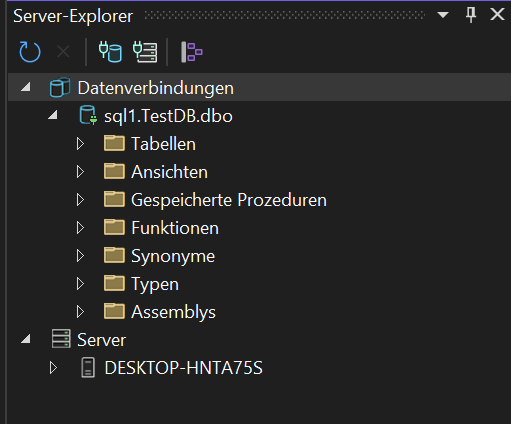
Nun kann man per Rechtsklick auf Datenverbindungen eine neue Datenverbindung hinzufügen.
Das sich öffende Fenster füllt man wie folgt aus:

* Datenquelle: Microsoft SQL Server (SQLClient)
* Servername: localhost
* Authentifizierung: SQL Server-Authentifizierung
* Benutzername: sa
* Passwort: <meinPasswort>
* Den Haken setzen bei "Passwort speichern".
* Datenbanknamen auswählen oder eingeben: TestDB

Per "Testverbindung" kann man die Verbindungprüfen und dann mit "Ok" die Verbindung aufsetzen.

### Useranmeldung

Zuerst öffnet man den Projektmappen-Explorer (STRG+ALT+L). Hier sucht man unter App.Core den Ordern Services und darunter die Datei AuthenticationService.cs.

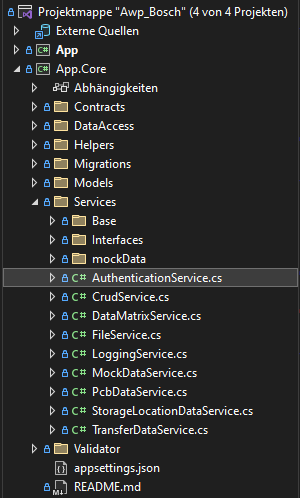

Diese Datei öffnet man mit einem Doppelklick. In dieser Datei sucht man nach der Funktion authenticate(). Diese sollte in Zeile 16 liegen.

Nun kann man durch klicken am linken Rand einen Breakpoint nach dem Aufruf von "var adUsername = Environment.UserName;" setzen.

Wenn man nun die Applikation startet wird diese hier stoppen. In den Variablen findet man nun den Wert von AdUsername.

Wenn noch keine Verbindung zur Datenbank über den Server-Explorer hergestellt wurde, hilft diese [Dokumentation](https://learn.microsoft.com/de-de/visualstudio/data-tools/add-new-connections?view=vs-2022) dazu.

Über den oben beschrieben Server - Explorer (STRG+ALT+S) nimmt man Verbindung mit DB-Server auf. Mit einem Rechtsklick auf den Server öffnet man das Kontextmenü. Hier wählt man "Neue Abfrage aus" und gibt die folgende Transaktion ab.

>BEGIN TRANSACTION;\
>BEGIN TRY\
>INSERT INTO [dbo].[Users] ([Name], [AdUsername], [CreatedDate], [DeletedDate])\
>VALUES ('BliebigerName', 'HIER_DEIN_NTUSERNAME', GETDATE(), '01-01-1999');\
>COMMIT;\
>END TRY\
>BEGIN CATCH\
>ROLLBACK;\
>END CATCH;

Anschließend öffnet man den Server-Explorer mit STRG+ALT+S und öffnet Datenverbindungen->sql1.TestDB.dbo und navigiert zu Tabellen und dort zu Users.
Hier macht man einen Rechtsklick auf Users und wählt Tabellendaten anzeigen. Hier kann man dann die Rolle des Users prüfen. Wenn in der Rolle nicht die gewünschte Rolle steht, lässt sich das hier ändern.
Für einen neuerstellen User wäre dies in unserem Fall Admin.

#### NT User von Stefan und Thomas anlegen
Über den Server-Explorer setzt man nun eine neue Abfrage ab.

Für Stefans User setzt man ab:

>BEGIN TRANSACTION;\
>BEGIN TRY\
>INSERT INTO [dbo].[Users] ([Name], [AdUsername], [CreatedDate], [DeletedDate])\
>VALUES ('Stefan', 'scs3pl', GETDATE(), '01-01-1999');\
>COMMIT;\
>END TRY\
>BEGIN CATCH\
>ROLLBACK;\
>END CATCH;

Für Thomas User setzt man ab:

>BEGIN TRANSACTION;\
>BEGIN TRY\
>INSERT INTO [dbo].[Users] ([Name], [AdUsername], [CreatedDate], [DeletedDate])\
>VALUES ('Thomas', 'thh3pl', GETDATE(), '01-01-1999');\
>COMMIT;\
>END TRY\
>BEGIN CATCH\
>ROLLBACK;\
>END CATCH;

Anschließend öffnet man den Server-Explorer mit STRG+ALT+S und öffnet Datenverbindungen->sql1.TestDB.dbo und navigiert zu Tabellen und dort zu Users.
Hier macht man einen Rechtsklick auf Users und wählt Tabellendaten anzeigen. Hier kann man dann die Rolle des Users prüfen. Wenn in der Rolle nicht die gewünschte Rolle steht, lässt sich das hier ändern.
Für einen neuerstellen User wäre dies in unserem Fall Admin.

### Testdaten einfügen
Wenn noch keine Verbindung zur Datenbank über den Server-Explorer hergestellt wurde, hilft diese [Dokumentation](https://learn.microsoft.com/de-de/visualstudio/data-tools/add-new-connections?view=vs-2022) dazu.

Über den oben beschrieben Server - Explorer (STRG+ALT+S) nimmt man Verbindung mit DB-Server auf und gibt die folgenden Befehle ab.

Für die Lagerorte
>INSERT INTO [dbo].[StorageLocations] ([StorageName], [DwellTimeYellow], [DwellTimeRed], [CreatedDate], [DeletedDate], [IsFinalDestination])\
>VALUES\
>    ('PVB-Labor', '4', '9', GETDATE(), '01-01-2002', 0),\
>    ('PVB-Schrott', '--', '--', GETDATE(), '01-01-2002', 1),\
>    ('PVB230-XXX', '6', '8', GETDATE(), '01-01-2002', 0),\
>    ('PVB320-KRL', '4', '13', GETDATE(), '01-01-2002', 0),\
>    ('PVB330-XXX', '12', '20', GETDATE(), '01-01-2002', 0),\
>    ('PVB-NIO (roter Tisch)', '3', '7', GETDATE(), '01-01-2002', 0);

Für die Sachnummern

>INSERT INTO [dbo].[PcbTypes] ([PcbPartNumber], [MaxTransfer], [CreatedDate], [DeletedDate], [Description])\
>VALUES\
>('1688400308', 4, GETDATE(), '01-01-2002', N'MT-Modul'),\
>('1688400320', 4, GETDATE(), '01-01-2002', N'EPS-815'),\
>('1688400333', 4, GETDATE(), '01-01-2002', N'EPS-815'),\
>('1688400438', 4, GETDATE(), '01-01-2002', N'FSA500'),\
>('1688400468', 4, GETDATE(), '01-01-2002', N'BEA060'),\
>('1688400469', 4, GETDATE(), '01-01-2002', N'BEA070'),\
>('1688400499', 4, GETDATE(), '01-01-2002', N'BEA070 + Bluetooth LP'),\
>('1688400508', 4, GETDATE(), '01-01-2002', N'KTS59X Expansion Board'),\
>('1688400515', 4, GETDATE(), '01-01-2002', N'FSA500 + Bluetooth LP'),\
>('1688400516', 3, GETDATE(), '01-01-2002', N'MDI2 - Expansion Board'),\
>('1688400517', 2, GETDATE(), '01-01-2002', N'KTS56X Expansion Board'),\
>('1688400536', 1, GETDATE(), '01-01-2002', N'EPS205 (LP505 + LP451)'),\
>('1688400545', 2, GETDATE(), '01-01-2002', N'EPS7XX CPU'),\
>('1688400552', 3, GETDATE(), '01-01-2002', N'Daimler Mainboard'),\
>('1688400553', 2, GETDATE(), '01-01-2002', N'Daimler Extensionboard'),\
>('1688400566', 1, GETDATE(), '01-01-2002', N'VCMM Expansion Board'),\
>('1688400579', 4, GETDATE(), '01-01-2002', N'KTS-Funk Basis LP'),\
>('1688400580', 2, GETDATE(), '01-01-2002', N'VCMM Mainboard'),\
>('1688400586', 3, GETDATE(), '01-01-2002', N'JLR'),\
>('1688400593', 2, GETDATE(), '01-01-2002', N'DCI700'),\
>('1688400598', 1, GETDATE(), '01-01-2002', N'KTS250 Board'),\
>('1688400627', 2, GETDATE(), '01-01-2002', N'VCI-Renault ohne Display'),\
>('1688400628', 3, GETDATE(), '01-01-2002', N'VCI-Renault mit Display'),\
>('1688400643', 3, GETDATE(), '01-01-2002', N'BEA030 Modul'),\
>('1688400651', 4, GETDATE(), '01-01-2002', N'GVCI China'),\
>('1688400656', 2, GETDATE(), '01-01-2002', N'MDI2 Mainbaord (neu)'),\
>('1688400664', 3, GETDATE(), '01-01-2002', N'IVS- Europa'),\
>('1688400671', 2, GETDATE(), '01-01-2002', N'MDI2 Mainboard (Variante GAC)'),\
>('1688403383', 3, GETDATE(), '01-01-2002', N'KTS-NG Mainboard unprogrammiert'),\
>('F00K108925', 1, GETDATE(), '01-01-2002', N'Vetronix Mainboard'),\
>('F00K108927', 2, GETDATE(), '01-01-2002', N'Vetronix Expansionboard');

## Starten der Applikation
Zum Starten der Applikation ist sicherzustellen, dass der Container auf [docker](https://www.docker.com/products/docker-desktop/) läuft. Dafür öffnet man Docker Desktop und klickt auf den Reiter Container.
Der Container "sql1" sollte laufen. Das ist am Status "running" erkennbar.

Nun kann man in Visual Studio mit "F5" die Applikation starten.

## Erstellen von Migrations

Hierfür benötigt man das EntityFrameworkCore Tooling. Zur Installation öffnet man eine Powershell und gibt folgenden Befehl ab:
   >dotnet tool install --global dotnet-ef

Dafür benötigt man die Referenz Microsoft.EntityFrameworkCore.Design NuGet-Package im Projekt. Dies kann man über den Projektmappen-Explorer STRG+ALT+L oder über den Reiter Ansicht öffnen.
Im projektmappen-Explorer klickt man mittels Rechtsklick auf das Projekt und wählt NuGet-Pakete für Projektmappe verwalten. Hier kann man nun prüfen, ob diese aktiv sind. Gegebenenfalls kann man sie hier auch runterladen.

Wenn es einen Fehler gibt, dass der Code eine neuere Version benutzt als das Tool, kann man in der Powershell, mit dem folgenden Befehl die Installation aktualisieren.
   >dotnet tool update --global dotnet-ef

Wenn man eine Migration auf das in der von DbContext erbenden Klasse angegebene Datenmodell hinzufügen will, kann man das hiermit machen:
   >dotnet ef migrations add <Name der Migration>

Migrationsordner und Migration-Klassen werden automatisch generiert.Dieser Schritt ist nur dann auszuführen, wenn Änderungen an Datenmodelle durchgeführt wurden.

Mit:
>dotnet ef database update

überträgt das Schema, welches in den Migrations festgelegt wurde auf die DB, welche im Connectionstring angegeben ist.
Dieser Befehl muss im App.Core Verzeichnis ausgeführt werden.

Wenn man die Migrations in SQL haben möchte, kann man das hiermit tun:
>dotnet ef migrations script

Die Migration für das aktuelle Projekt sind wie folgt:

    IF OBJECT_ID(N'[__EFMigrationsHistory]') IS
    BEGIN
        CREATE TABLE [__EFMigrationsHistory] (
            [MigrationId] nvarchar(150) NOT NULL,
            [ProductVersion] nvarchar(32) NOT NULL,
            CONSTRAINT [PK___EFMigrationsHistory] PRIMARY KEY ([MigrationId])
        );
    END;
    GO

    BEGIN TRANSACTION;
    GO

    CREATE TABLE [AuditEntries] (
        [Id] int NOT NULL IDENTITY,
        [Message] nvarchar(250) NULL,
        [Level] nvarchar(20) NULL,
        [Exception] nvarchar(max) NULL,
        [CreatedDate] datetime2 NOT NULL,
        [DeletedDate] datetime2 NOT NULL,
        CONSTRAINT [PK_AuditEntries] PRIMARY KEY ([Id])
    );
    GO

    CREATE TABLE [Devices] (
        [Id] int NOT NULL IDENTITY,
        [Name] nvarchar(50) NOT NULL,
        [CreatedDate] datetime2 NOT NULL,
        [DeletedDate] datetime2 NOT NULL,
        CONSTRAINT [PK_Devices] PRIMARY KEY ([Id])
    );
    GO

    CREATE TABLE [Diagnoses] (
        [Id] int NOT NULL IDENTITY,
        [Name] nvarchar(650) NOT NULL,
        [CreatedDate] datetime2 NOT NULL,
        [DeletedDate] datetime2 NOT NULL,
        CONSTRAINT [PK_Diagnoses] PRIMARY KEY ([Id])
    );
    GO

    CREATE TABLE [ErrorTypes] (
        [Id] int NOT NULL IDENTITY,
        [Code] nvarchar(5) NOT NULL,
        [ErrorDescribtion] nvarchar(650) NOT NULL,
        [CreatedDate] datetime2 NOT NULL,
        [DeletedDate] datetime2 NOT NULL,
        CONSTRAINT [PK_ErrorTypes] PRIMARY KEY ([Id])
    );
    GO

    CREATE TABLE [PcbTypes] (
        [Id] int NOT NULL IDENTITY,
        [PcbPartNumber] nvarchar(10) NOT NULL,
        [MaxTransfer] int NOT NULL,
        [CreatedDate] datetime2 NOT NULL,
        [DeletedDate] datetime2 NOT NULL,
        CONSTRAINT [PK_PcbTypes] PRIMARY KEY ([Id]) 
    );
    GO

    CREATE TABLE [StorageLocations] (
        [Id] int NOT NULL IDENTITY,
        [StorageName] nvarchar(50) NOT NULL,
        [DwellTimeYellow] int NOT NULL,
        [DwellTimeRed] int NOT NULL,
        [CreatedDate] datetime2 NOT NULL,
        [DeletedDate] datetime2 NOT NULL,
        CONSTRAINT [PK_StorageLocations] PRIMARY KEY ([Id])
    );
    GO

    CREATE TABLE [Users] (
        [Id] int NOT NULL IDENTITY,
        [Name] nvarchar(50) NULL,
        [AdUsername] nvarchar(50) NULL,
        [CreatedDate] datetime2 NOT NULL,
        [DeletedDate] datetime2 NOT NULL,
        CONSTRAINT [PK_Users] PRIMARY KEY ([Id])
    );
    GO

    CREATE TABLE [Comments] (
        [Id] int NOT NULL IDENTITY,
        [Name] nvarchar(650) NOT NULL,
        [NotedById] int NOT NULL,
        [CreatedDate] datetime2 NOT NULL,
        [DeletedDate] datetime2 NOT NULL,
        CONSTRAINT [PK_Comments] PRIMARY KEY ([Id]),
        CONSTRAINT [FK_Comments_Users_NotedById] FOREIGN KEY ([NotedById]) REFERENCES [Users] ([Id]) ON DELETE CASCADE
    );
    GO

    CREATE TABLE [Pcbs] (
        [Id] int NOT NULL IDENTITY,
        [SerialNumber] nvarchar(10) NULL,
        [RestrictionId] int NULL,
        [ErrorDescription] nvarchar(650) NULL,
        [Finalized] bit NOT NULL,
        [PcbTypeId] int NOT NULL,
        [CommentId] int NULL,
        [EnddiagnoseId] int NULL,
        [CreatedDate] datetime2 NOT NULL,
        [DeletedDate] datetime2 NOT NULL,
        CONSTRAINT [PK_Pcbs] PRIMARY KEY ([Id]),
        CONSTRAINT [FK_Pcbs_Comments_CommentId] FOREIGN KEY ([CommentId]) REFERENCES [Comments] ([Id]),
        CONSTRAINT [FK_Pcbs_Devices_RestrictionId] FOREIGN KEY ([RestrictionId]) REFERENCES [Devices] ([Id]),
        CONSTRAINT [FK_Pcbs_Diagnoses_EnddiagnoseId] FOREIGN KEY ([EnddiagnoseId]) REFERENCES [Diagnoses] ([Id]),
        CONSTRAINT [FK_Pcbs_PcbTypes_PcbTypeId] FOREIGN KEY ([PcbTypeId]) REFERENCES [PcbTypes] ([Id]) ON DELETE CASCADE
    );
    GO

    CREATE TABLE [ErrorTypePcb] (
        [ErrorTypesId] int NOT NULL,
        [PcbsId] int NOT NULL,
        CONSTRAINT [PK_ErrorTypePcb] PRIMARY KEY ([ErrorTypesId], [PcbsId]),
        CONSTRAINT [FK_ErrorTypePcb_ErrorTypes_ErrorTypesId] FOREIGN KEY ([ErrorTypesId]) REFERENCES [ErrorTypes] ([Id]) ON DELETE CASCADE,
        CONSTRAINT [FK_ErrorTypePcb_Pcbs_PcbsId] FOREIGN KEY ([PcbsId]) REFERENCES [Pcbs] ([Id]) ON DELETE CASCADE
    );
    GO

    CREATE TABLE [Transfers] (
        [Id] int NOT NULL IDENTITY,
        [Anmerkung] nvarchar(max) NULL,
        [NachId] int NOT NULL,
        [VerbuchtVonId] int NOT NULL,
        [LeiterplatteId] int NULL,
        [CreatedDate] datetime2 NOT NULL,
        [DeletedDate] datetime2 NOT NULL,
        CONSTRAINT [PK_Transfers] PRIMARY KEY ([Id]),
        CONSTRAINT [FK_Transfers_Pcbs_LeiterplatteId] FOREIGN KEY ([LeiterplatteId]) REFERENCES [Pcbs] ([Id]),
        CONSTRAINT [FK_Transfers_StorageLocations_NachId] FOREIGN KEY ([NachId]) REFERENCES [StorageLocations] ([Id]) ON DELETE CASCADE,
        CONSTRAINT [FK_Transfers_Users_VerbuchtVonId] FOREIGN KEY ([VerbuchtVonId]) REFERENCES [Users] ([Id]) ON DELETE CASCADE
    );
    GO

    CREATE INDEX [IX_Comments_NotedById] ON [Comments] ([NotedById]);
    GO

    CREATE INDEX [IX_ErrorTypePcb_PcbsId] ON [ErrorTypePcb] ([PcbsId]);
    GO

    CREATE UNIQUE INDEX [IX_Pcbs_CommentId] ON [Pcbs] ([CommentId]) WHERE [CommentId] IS NOT NULL;
    GO

    CREATE INDEX [IX_Pcbs_EnddiagnoseId] ON [Pcbs] ([EnddiagnoseId]);
    GO

    CREATE INDEX [IX_Pcbs_PcbTypeId] ON [Pcbs] ([PcbTypeId]);
    GO

    CREATE INDEX [IX_Pcbs_RestrictionId] ON [Pcbs] ([RestrictionId]);
    GO

    CREATE INDEX [IX_Transfers_LeiterplatteId] ON [Transfers] ([LeiterplatteId]);
    GO

    CREATE INDEX [IX_Transfers_NachId] ON [Transfers] ([NachId]);
    GO

    CREATE INDEX [IX_Transfers_VerbuchtVonId] ON [Transfers] ([VerbuchtVonId]);
    GO

    INSERT INTO [__EFMigrationsHistory] ([MigrationId], [ProductVersion])
    VALUES (N'20230426221130_Init', N'6.0.16');
    GO

    COMMIT;
    GO

    BEGIN TRANSACTION;
    GO

    ALTER TABLE [Pcbs] DROP CONSTRAINT [FK_Pcbs_Diagnoses_EnddiagnoseId];
    GO

    ALTER TABLE [Transfers] DROP CONSTRAINT [FK_Transfers_Pcbs_LeiterplatteId];
    GO

    ALTER TABLE [Transfers] DROP CONSTRAINT [FK_Transfers_StorageLocations_NachId];
    GO

    ALTER TABLE [Transfers] DROP CONSTRAINT [FK_Transfers_Users_VerbuchtVonId];
    GO

    EXEC sp_rename N'[Transfers].[VerbuchtVonId]', N'StorageLocationId', N'COLUMN';
    GO

    EXEC sp_rename N'[Transfers].[NachId]', N'NotedById', N'COLUMN';
    GO

    EXEC sp_rename N'[Transfers].[LeiterplatteId]', N'PcbId', N'COLUMN';
    GO

    EXEC sp_rename N'[Transfers].[Anmerkung]', N'Comment', N'COLUMN';
    GO

    EXEC sp_rename N'[Transfers].[IX_Transfers_VerbuchtVonId]', N'IX_Transfers_StorageLocationId', N'INDEX';
    GO

    EXEC sp_rename N'[Transfers].[IX_Transfers_NachId]', N'IX_Transfers_NotedById', N'INDEX';
    GO

    EXEC sp_rename N'[Transfers].[IX_Transfers_LeiterplatteId]', N'IX_Transfers_PcbId', N'INDEX';
    GO

    EXEC sp_rename N'[Pcbs].[EnddiagnoseId]', N'DiagnoseId', N'COLUMN';
    GO

    EXEC sp_rename N'[Pcbs].[IX_Pcbs_EnddiagnoseId]', N'IX_Pcbs_DiagnoseId', N'INDEX';
    GO

    ALTER TABLE [Pcbs] ADD CONSTRAINT [FK_Pcbs_Diagnoses_DiagnoseId] FOREIGN KEY ([DiagnoseId]) REFERENCES [Diagnoses] ([Id]);
    GO

    ALTER TABLE [Transfers] ADD CONSTRAINT [FK_Transfers_Pcbs_PcbId] FOREIGN KEY ([PcbId]) REFERENCES [Pcbs] ([Id]);
    GO

    ALTER TABLE [Transfers] ADD CONSTRAINT [FK_Transfers_StorageLocations_StorageLocationId] FOREIGN KEY ([StorageLocationId]) REFERENCES [StorageLocations] ([Id]) ON DELETE CASCADE;
    GO

    ALTER TABLE [Transfers] ADD CONSTRAINT [FK_Transfers_Users_NotedById] FOREIGN KEY ([NotedById]) REFERENCES [Users] ([Id]) ON DELETE CASCADE;
    GO

    INSERT INTO [__EFMigrationsHistory] ([MigrationId], [ProductVersion])
    VALUES (N'20230427195318_changeToEngAddition', N'6.0.16');
    GO

    COMMIT;
    GO

    BEGIN TRANSACTION;
    GO

    ALTER TABLE [PcbTypes] ADD [Description] nvarchar(max) NOT NULL DEFAULT N'';
    GO

    INSERT INTO [__EFMigrationsHistory] ([MigrationId], [ProductVersion])
    VALUES (N'20230428085623_PcbTypAddedDescription', N'6.0.16');
    GO

    COMMIT;
    GO

    BEGIN TRANSACTION;
    GO

    EXEC sp_rename N'[ErrorTypes].[ErrorDescribtion]', N'ErrorDescription', N'COLUMN';
    GO

    EXEC sp_rename N'[Comments].[Name]', N'Content', N'COLUMN';
    GO

    ALTER TABLE [StorageLocations] ADD [IsFinalDestination] bit NOT NULL DEFAULT CAST(0 AS bit);
    GO

    INSERT INTO [__EFMigrationsHistory] ([MigrationId], [ProductVersion])
    VALUES (N'20230509124816_AddedFinalDestination', N'6.0.16');
    GO

    COMMIT;
    GO
    
    BEGIN TRANSACTION;
    GO

    DROP TABLE [ErrorTypePcb];
    GO

    ALTER TABLE [ErrorTypes] ADD [PcbId] int NULL;
    GO

    CREATE INDEX [IX_ErrorTypes_PcbId] ON [ErrorTypes] ([PcbId]);
    GO
    
    ALTER TABLE [ErrorTypes] ADD CONSTRAINT [FK_ErrorTypes_Pcbs_PcbId] FOREIGN KEY ([PcbId]) REFERENCES [Pcbs] ([Id]);
    GO

    INSERT INTO [__EFMigrationsHistory] ([MigrationId], [ProductVersion])
    VALUES (N'20230511234327_UpdatedErrorType', N'6.0.16');
    GO

    COMMIT;
    GO

    BEGIN TRANSACTION;
     GO

    INSERT INTO [__EFMigrationsHistory] ([MigrationId], [ProductVersion])
    VALUES (N'20230512222413_AddedForeignKey', N'6.0.16');
    GO

    COMMIT;
    GO

    BEGIN TRANSACTION;
    GO

    INSERT INTO [__EFMigrationsHistory] ([MigrationId], [ProductVersion])
    VALUES (N'20230512222830_AddedFKTransfer', N'6.0.16');
    GO

    COMMIT;
    GO

    BEGIN TRANSACTION;
    GO
    
    INSERT INTO [__EFMigrationsHistory] ([MigrationId], [ProductVersion])
    VALUES (N'20230512223618_AddedFKTransferNotedById', N'6.0.16');
    GO

    COMMIT;
    GO

    BEGIN TRANSACTION;
    GO

    INSERT INTO [__EFMigrationsHistory] ([MigrationId], [ProductVersion])
    VALUES (N'20230523145814_AddExplicitDiagnoseFKToPcb', N'6.0.16');
    GO

    COMMIT;
    GO

    BEGIN TRANSACTION;
    GO

    ALTER TABLE [Transfers] DROP CONSTRAINT [FK_Transfers_Pcbs_PcbId];
    GO

    DROP INDEX [IX_Transfers_PcbId] ON [Transfers];
    DECLARE @var0 sysname;
    SELECT @var0 = [d].[name]
    FROM [sys].[default_constraints] [d]
    INNER JOIN [sys].[columns] [c] ON [d].[parent_column_id] = [c].[column_id] AND [d].[parent_object_id] = [c].[object_id]
    WHERE ([d].[parent_object_id] = OBJECT_ID(N'[Transfers]') AND [c].[name] = N'PcbId');
    IF @var0 IS NOT NULL EXEC(N'ALTER TABLE [Transfers] DROP CONSTRAINT [' + @var0 + '];');
    ALTER TABLE [Transfers] ALTER COLUMN [PcbId] int NOT NULL;
    ALTER TABLE [Transfers] ADD DEFAULT 0 FOR [PcbId];
    CREATE INDEX [IX_Transfers_PcbId] ON [Transfers] ([PcbId]);
    GO

    ALTER TABLE [Transfers] ADD CONSTRAINT [FK_Transfers_Pcbs_PcbId] FOREIGN KEY ([PcbId]) REFERENCES [Pcbs] ([Id]) ON DELETE CASCADE;
    GO

    INSERT INTO [__EFMigrationsHistory] ([MigrationId], [ProductVersion])
    VALUES (N'20230523151022_AddExplicitPcbFKToTransfer', N'6.0.16');
    GO

    COMMIT;
    GO

    BEGIN TRANSACTION;
    GO

    DECLARE @var1 sysname;
    SELECT @var1 = [d].[name]
    FROM [sys].[default_constraints] [d]
    INNER JOIN [sys].[columns] [c] ON [d].[parent_column_id] = [c].[column_id] AND [d].[parent_object_id] = [c].[object_id]
    WHERE ([d].[parent_object_id] = OBJECT_ID(N'[StorageLocations]') AND [c].[name] = N'DwellTimeYellow');
    IF @var1 IS NOT NULL EXEC(N'ALTER TABLE [StorageLocations] DROP CONSTRAINT [' + @var1 + '];');
    ALTER TABLE [StorageLocations] ALTER COLUMN [DwellTimeYellow] nvarchar(max) NULL;
    GO

    DECLARE @var2 sysname;
    SELECT @var2 = [d].[name]
    FROM [sys].[default_constraints] [d]
    INNER JOIN [sys].[columns] [c] ON [d].[parent_column_id] = [c].[column_id] AND [d].[parent_object_id] = [c].[object_id]
    WHERE ([d].[parent_object_id] = OBJECT_ID(N'[StorageLocations]') AND [c].[name] = N'DwellTimeRed');
    IF @var2 IS NOT NULL EXEC(N'ALTER TABLE [StorageLocations] DROP CONSTRAINT [' + @var2 + '];');
    ALTER TABLE [StorageLocations] ALTER COLUMN [DwellTimeRed] nvarchar(max) NULL;
    GO

    INSERT INTO [__EFMigrationsHistory] ([MigrationId], [ProductVersion])
    VALUES (N'20230529120028_''20230529_ChangeStorageLocation_dWellTime''', N'6.0.16');
    GO

    COMMIT;
    GO

    BEGIN TRANSACTION;
    GO

    INSERT INTO [__EFMigrationsHistory] ([MigrationId], [ProductVersion])
    VALUES (N'20230531141633_AddFkComment', N'6.0.16');
    GO

    COMMIT;
    GO

    BEGIN TRANSACTION;
    GO

    DECLARE @var3 sysname;
    SELECT @var3 = [d].[name]
    FROM [sys].[default_constraints] [d]
    INNER JOIN [sys].[columns] [c] ON [d].[parent_column_id] = [c].[column_id] AND [d].[parent_object_id] = [c].[object_id]
    WHERE ([d].[parent_object_id] = OBJECT_ID(N'[Diagnoses]') AND [c].[name] = N'Name');
    IF @var3 IS NOT NULL EXEC(N'ALTER TABLE [Diagnoses] DROP CONSTRAINT [' + @var3 + '];');
    ALTER TABLE [Diagnoses] ALTER COLUMN [Name] nvarchar(650) NULL;
    GO

    INSERT INTO [__EFMigrationsHistory] ([MigrationId], [ProductVersion])
    VALUES (N'20230604021534_AddNullableNameDevice', N'6.0.16');
    GO

    COMMIT;
    GO

    BEGIN TRANSACTION;
    GO

    DECLARE @var4 sysname;
    SELECT @var4 = [d].[name]
    FROM [sys].[default_constraints] [d]
    INNER JOIN [sys].[columns] [c] ON [d].[parent_column_id] = [c].[column_id] AND [d].[parent_object_id] = [c].[object_id]
    WHERE ([d].[parent_object_id] = OBJECT_ID(N'[ErrorTypes]') AND [c].[name] = N'ErrorDescription');
    IF @var4 IS NOT NULL EXEC(N'ALTER TABLE [ErrorTypes] DROP CONSTRAINT [' + @var4 + '];');
    ALTER TABLE [ErrorTypes] ALTER COLUMN [ErrorDescription] nvarchar(650) NULL;
    GO

    DECLARE @var5 sysname;
    SELECT @var5 = [d].[name]
    FROM [sys].[default_constraints] [d]
    INNER JOIN [sys].[columns] [c] ON [d].[parent_column_id] = [c].[column_id] AND [d].[parent_object_id] = [c].[object_id]
    WHERE ([d].[parent_object_id] = OBJECT_ID(N'[ErrorTypes]') AND [c].[name] = N'Code');
    IF @var5 IS NOT NULL EXEC(N'ALTER TABLE [ErrorTypes] DROP CONSTRAINT [' + @var5 + '];');
    ALTER TABLE [ErrorTypes] ALTER COLUMN [Code] nvarchar(5) NULL;
    GO

    INSERT INTO [__EFMigrationsHistory] ([MigrationId], [ProductVersion])
    VALUES (N'20230604060933_RemoveRequiredCodeErrorDescription', N'6.0.16');
    GO

    COMMIT;
    GO

    BEGIN TRANSACTION;
    GO

    ALTER TABLE [Users] ADD [Role] nvarchar(24) NOT NULL DEFAULT N'';
    GO

        INSERT INTO [__EFMigrationsHistory] ([MigrationId], [ProductVersion])
        VALUES (N'20230613155842_AddUserRole', N'6.0.16');
        GO

        COMMIT;
        GO

## .exe Erstellen
Über den Projektmappen-Explorer (STRG+ALT+L) kann man per Rechtklick auf App ein Kontextmenü öffnen. Hir wählt man die Rubrik Veröffentlichen aus.

Nun wählt man als Veröffentlichungsprofil und Ziel immer den Ordner aus.
Nun öffent sich das neue Fenster wie unten.
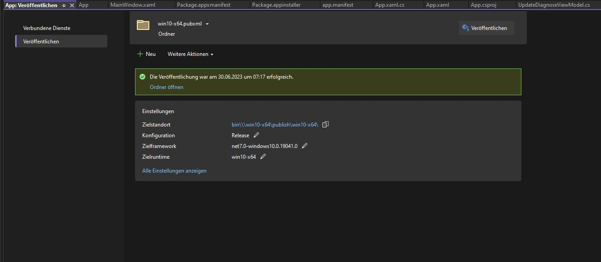)
Hier wählt man "Alle Einstellungen  anzeigen" aus.
Dann füllt man das wie folgt aus:

Nach dem Speichern kommt man auf der vorherigen Seite wieder raus und wählt oben rechts die Option "Veröffentlichen". Dies startet einen Buildvorgang. Dieser kann etwas dauern.
Nach Abschluss des Builds kann man die App.exe im ausgewählten Zielordner finden.

## Betriebsanleitung

Im Folgenden werden die möglichen Anwendungsfälle beschrieben. Hier können Sie die Handhabung der Anwendung nachlesen. Bei Fragen melden Sie sich bei Ihrem Vorgesetzen.

### Leiterplatten

In diesem Abschnitt werden alle Funktionalitäten unter dem Reiter Leiterplatte beschrieben.

Ein Ampelsystem an Anfang jeder Leiterplatte beschreibt den Zustand der Leiterplatte und den Bedarf einer Aktion bezüglich der Verweildauer.

Ein Filter hilft die Ansicht so anzupassen, so dass die nötigen Elemente angezeigt werden.
Über die Suche können Leiterplatten nach der Seriennummer gesucht werden.
Über die Pfeile kann bei mehr Einträgen als in Einträge je Seite ausgewählt zwischen Seiten gewählt werden. Alternativ lassen sich auch mehr Einträge je Seite anzeigen, dazu erhöht man den entsprechenden Wert.
Über den Balken unten lässt sich die Ansicht horizontal verschieben. Auf der ganz rechten Seite einer jeder Platte gibt es ein Aktionsmenü. Hier kommt man zur Detailansicht, kann die Leiterplatte bearbeiten, löschen und weitergeben.

#### Leiterplatte hinzufügen
Im Rechten oberen Ecke findet sich eine Menüleiste, welche das Icon fürs Hinzufügen enthält. Durch einen Klick öffnet sich eine Maske, in welcher die neue Leiterplatte angelegt werden kann.

Das Datum wird über ein Kalender Pop-up augewählt. Standardmäßig ist das aktuelle Datum hinterlegt. Der Benutzername sollte automatisch ausgefüllt werden. Wenn in der Anwendung nicht der eigene Name hinterlegt ist, sollte aus Sicherheitsgründen der Vorgesetze informiert werden.
Dann kann eine Sachnummer gewählt werden, wenn sie im Auswahlmenü nicht auftaucht, kann sie unter den Stammdaten hinzugefügt werden. Die Seriennummer (zehnstellige Zahl) wird in das Feld der Seriennummer eingetragen.
Unter Fehlerbeschreibung kann dann eine Fehler ID und eine Beschreibung hinterlegt werden. Nun muss nur noch der Lagerort über Weitergabe gewählt werden.
Wenn der Lagerort oder die Fehlerkategorie nicht hinterlegt ist, kann dies in den Stammdaten nachgeholt werden.

#### Leiterplatten Detailansicht
Die Leiterplatten-Detailansicht kann über den Leiterplattenreiter über das Aktionsmenü der einzelnen Leiterplatte ausgewählt werden. Hier gibt es die Funktion zum Einfügen von Einschränkungen oder Anmerkungen. Zusätzlich kann man die Leiterplatte drucken, bearbeiten, löschen und weitergeben. 
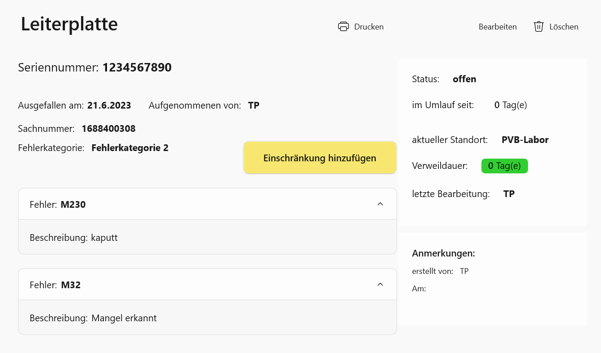

Die Umlaufhistorie zeigt absteigend alle Orte, die eine Leiterplatte besucht hat. Für genauere Informationen kann man diese per Klicken expandieren und wieder verkleinern.

##### Detailansicht Anmerkung hinzufügen
In der Detailansicht einer Leiterplatte kann man über den weißen Button rechts unten eine Anmerkung hinzufügen. Mittels Speichern wird die Änderung gespeichert und über Abbrechen verworfen.
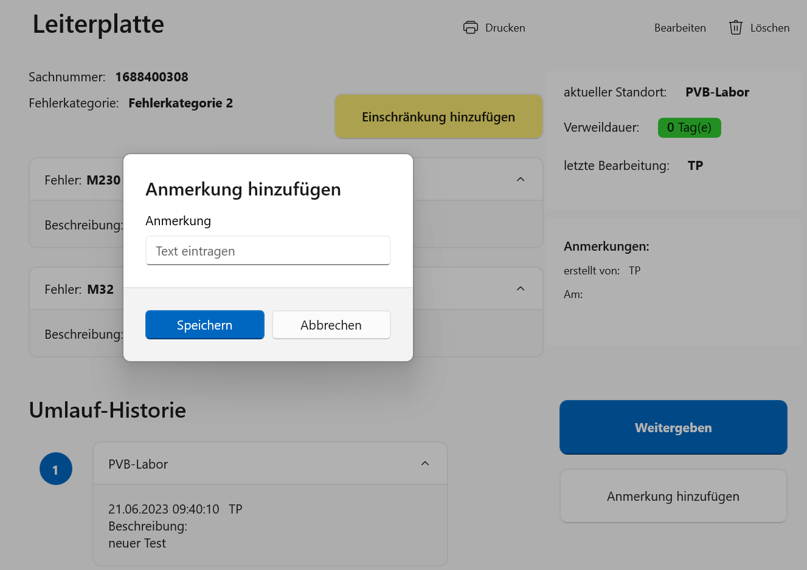

##### Detailansicht Einschränkung hinzufügen
Über den gelben Button oben mittig lassen sich Anmerkungen für die ausgewählte Leiterplatte hinzufügen. Die Änderung wird mittels Speichern übernommen und über Abbrechen verworfen.

##### Detailansicht Leiterplatte löschen
Mit dem Löschen Button rechts oben in der Detailansicht wird die ausgewählte Leiterplatte gelöscht. In einem aufgehenden Fenster muss die Löschung dann bestätigt werden.

##### Detailansicht Leiterplatte weitergeben
Über den blauen Button in der Detailansicht kann die ausgewählte Leiterplatte weitergegeben werden. Im Eingang wird das Datum in einem Kalender gewählt. Standardmäßig ist das aktuelle Datum hinterlegt. Unter Weitergabe muss der eigene User hinterlegt sein, sonst ist aus Sicherheitsgründen der Vorgesetze zu informieren. Nun werden Ort und Fehlerkategorie ausgewählt. Der Ort referenziert hier den Lagerort.
Wenn der gewünschte Lagerort oder die gewünschte Fehlerkategorie fehlen, können diese in den Stammdaten hinzugefügt werden.

Zusätzlich kann eine Anmerkung hinterlegt werden.

##### Detailansicht Drucken
Die Druckfunktion findet sich oben in der Detailansicht einer Leiterplatte. Dieses Öffnet die bekannte Windows-Druck Maske und kann die aktuelle Übersicht drucken.
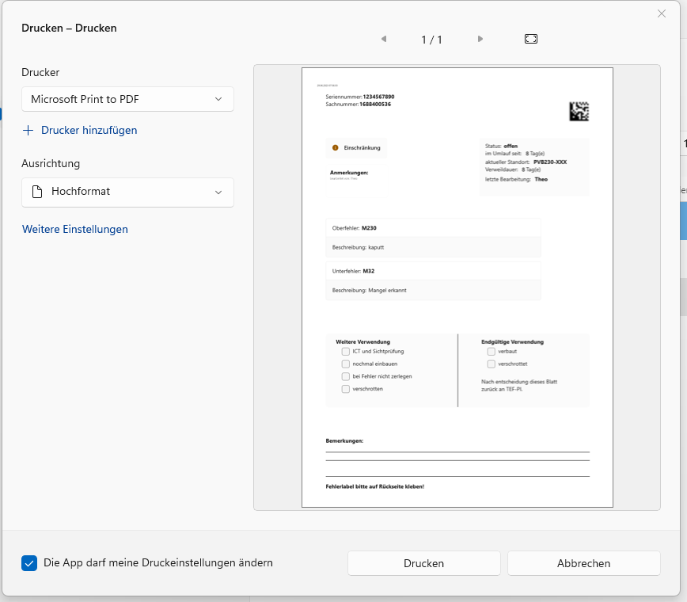
Die gedruckte Detailansicht stellt den Laufzettel dar.

#### Leiterplatte weitergeben
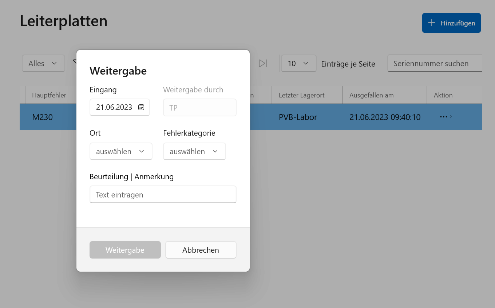

Über das Aktionsmenü und den Bereich Weitergabe kann eine Leiterplatte weitergegeben werden.
In der sich öffnenden Maske kann man nun den Termin der Weitergabe im Kalender auswählen, einen neuen Ort und eventuell eine neue Fehlerkategorie für die ausgewählte Leiterplatte wählen und eine Anmerkung hinzufügen. Standardmäßig ist das aktuelle Datum hinterlegt.
Über den Knopf "Weitergeben" schließt man den Prozess erfolgreich ab. Mit "Abbrechen" wird die Weitergabe unterbrochen.

#### Leiterplatte bearbeiten
Über das Aktionsfeld am rechten Ende jedes Eintrags in der Tabelle kann man das Bearbeitenmenü für die ausgewählte Leiterplatte öffnen. Hier sind alle aktuellen Daten dazu aufgelistet.
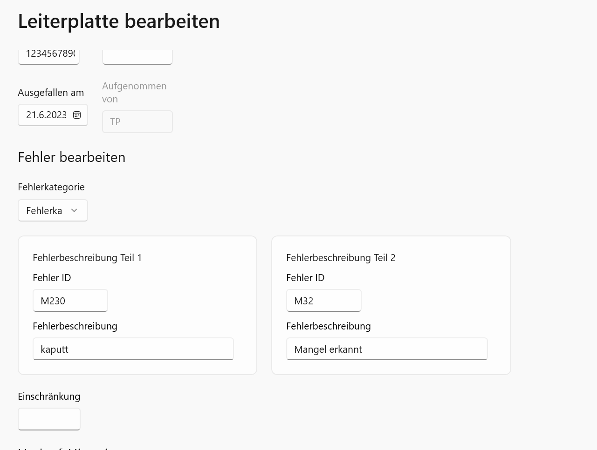
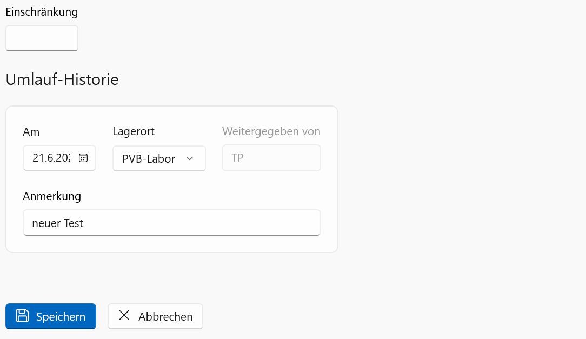

Die Werte lassen sich nun per Anklicken bearbeiten. 
Beachte bei der Bearbeitung gilt die gleiche Restriktion wie beim Erstellen:
* Die Seriennummer ist eine zehnstellige Zahl.

Wenn in den Drop-Down-Menüs die nötigen Fehlerkategorien oder Lagerorte nicht hinterlegt sind, können diese unter den Stammdaten hinterlegt werden.

Über den Hinzufügen-Button werden die Änderungen gespeichert. Über Abbrechen werden die alten Information vor der Änderung wieder hergestellt.

#### Leiterplatte suchen
Mit der Suchfunktion lassen sich einfach Leiterplatten suchen. Gesucht werden kann nach der Seriennummer.

#### Leiterplatten filtern
Hier kann die Ansicht angepasst werden, damit die wichtigsten Elemente oben angebracht werden. Es kann nach abgeschlossene Einträge, heute erstellte Leiterplatten und Lagerort filtern. Über Filter entfernen wird der aktuell angewandte Filter entfernt.

#### Leiterplatten löschen
Zum Löschen wählt man die Leiterplatte aus und wählt im Aktionsmenü löschen. Im dann öffnenden Dialogfenster muss das Löschen mittels "Löschen" bestätigen oder mit "Abbrechen" unterbrechen

### Auswertung
Unter dieser Rubrik finden sich die Auswertungsmöglichkeiten der gespeicherten Daten.

#### Dashboard
Im Dashboard erhält man eine Übersicht über das Ampelsystem und somit eine Gesamtübersicht über den Zustand der Verweildauerzeiten.
Im zweiten Abschnitt sieht man eine Übersicht über die Anzahl der heute neuangelegten und abgeschlossenen Leiterplatten, sowie der gesamte Umlauf.
Und es gibt eine Übersicht über die am häufigsten verwendeten Sachnummern, sowie die Lagerorte mit den meisten Leiterplatten.
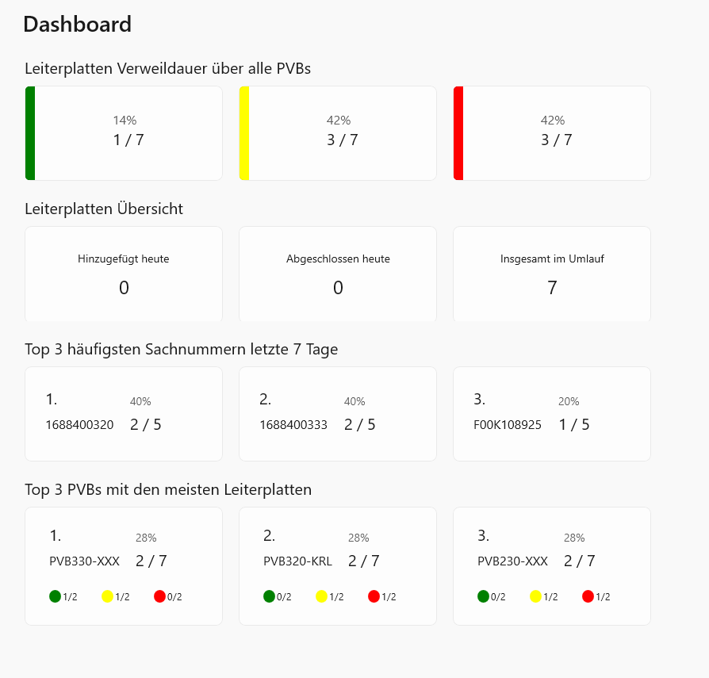

#### Verweildauer der Leiterplatten
Hier kann man einmal ein Start und ein Enddatum wählen. Standardmäßig wird sonst der aktuelle Tag betrachtet. Über "Auswerten" wird dann die durchschnittliche Verweildauer der Leiterplatten in den Lagerorten berechnnet.
Wenn ein Lagerort aufgeführt wird, ohne eine Verweildauer zu haben, hat der Lagerort zu dem Zeitpunkt keine Leiterplatten gehabt, aber zum aktuellen Zeitpunkt schon.
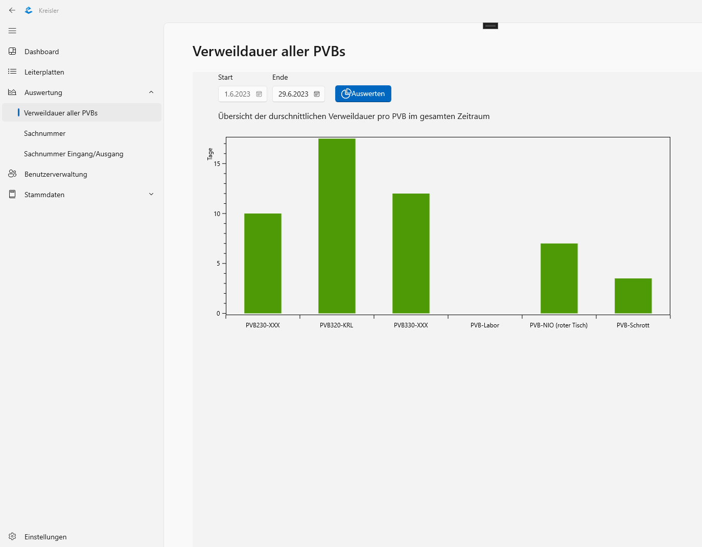

#### Sachnummer pro Lagerort
Über diesen Reiter lassen sich die Sachnummern analysieren und die damit verbundenen Leiterplatten.
Dafür wählt man zuerst eine der vorhandenen Sachnummern aus. Dann wird der Stichtag im Kalenderfenster ausgewählt. Standardmäßig ist das aktuelle Datum gesetzt.
Über Auswerten zeigt das Programm dann eine Auflistung aller Lagerorte an, welche Leiterplatten der gewählten Sachnummer enthalten. Hier erhält man eine Anzahl der Leiterplatten und die Anzahl der Tage verglichen zum Stichtag.
Zusätzlich zeigt ein Bearbeitungstatus, wie viele der Leiterplatten einer Sachnummer abgeschlossen oder noch offen ist.
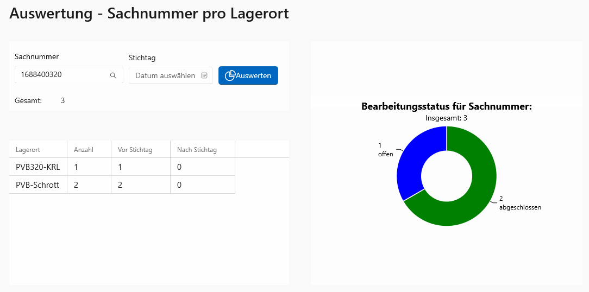

#### Sachnummer Ein- & Ausgang
Hier kann für einen gewissen Zeitraum geprüft werden, für welchen Lagerort welche Anzahl an Leiterplatten einer bestimmen Sachnummer ein- oder ausgegagen sind.
Dafür wählt man einen Start- und ein Enddatum. Dabei sollte beachtet werden, dass das Enddatum zeitlich hinter dem Startdatum steht.
Mit dem Filter können ungewünschte Sachnummern ausgeblendet werden.
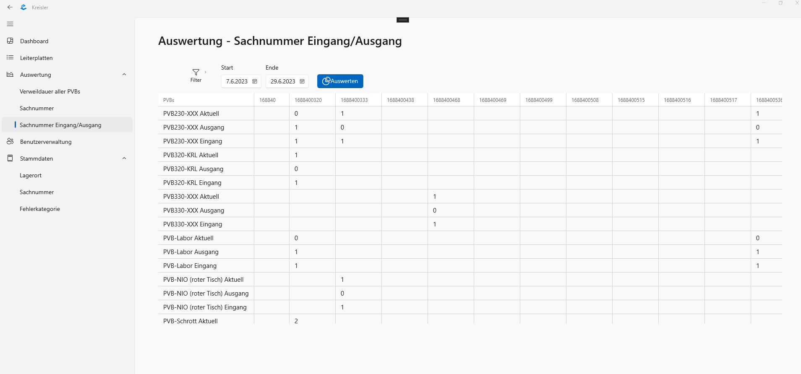

### Benutzerverwaltung
In der Benutzerverwaltung sieht man eine Übersicht der aktuellen Nutzer der App mit ihren Berechtigungen. Über das Aktionsmenü kann man mehr Funktionalitäten wie Löschen und Bearbeiten des gewählten Eintrag auswählen.

Über das Hinzufügen Feld rechts oben können neue Benutzer hinzugefügt werden.
Die Suche oben ermöglicht eine Suche nach Benutzern.

#### Benutzer hinzufügen
In das erste Feld ist der NT-User zu hinterlegen. Im nächsten der Name der Person (Formatierung: Name, Nachname). Im letzen Feld kann man per Drop-Down-Menü zwischen den möglichen Rollen wählen.

Durch den Blauen Hinzufügen Button wird die Eingabe gespeichert und der neue Nutzer hinzugefügt. Der Vorgang kann über den Abbrechen Button wieder beendet werden.

#### Benutzer bearbeiten
Über das Aktionsmenü in der Übersicht kann man die Funktion bearbeiten auswählen. Hier sind nun alle eingetragen Werte hinterlegt. Diese können durch Anklicken verändert werden.

Über Hinzufügen werden die Änderungen gespeichert. Mittels Abbrechen kann man den Vorgang unterbrechen, dann werden die Daten wieder auf den alten Stand vor der Änderung zurückgesetzt.
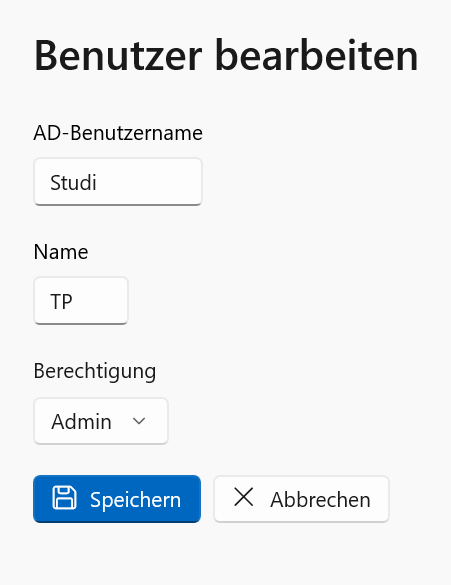

#### Benutzer löschen
Über das Aktionsmenü kann ein Eintrag gelöscht werden. Nun öffnet sich eine Maske, in welcher man den Vorgang bestätigen oder abbrechen kann. Im Hintergrung sieht dem den zu löschenden Eintrag blau markiert.

### Stammdaten
In der Stammdatenübersicht können die Daten eingesehen werden, mit denen aktuell gearbeitet werden. Hier können zusätzlich neue Sachnummern, Lagerorte oder Fehlerkategorien erstellt oder angepasst werden.

#### Lagerort
In diesem Untermenü finden sich alle Lagerorte mit ihren maximalen Lagerzeiten, bis das gelagerte Element in ihrem Status auf gelb oder rot wechselt.
Zusätzlich erkennt man, ob es sich um einen endgültigen Verbleib handelt.

Über das Aktionsmenü rechts kann der Lagerort bearbeitet oder gelöscht werden. Das Menü rechts oben bietet die Funktion einen neuen Lagerort hinzuzufügen oder nach dem Namen eines Lagerorts zu suchen.

##### Lagerort Hinzufügen
Über das Menü in der rechten oberen Ecke findet sich die Möglichkeit neue Lagerorte hinzuzufügen.

Unter Lagerort kann der Name des Lagerorts angepasst werden. Im Feld darunter kann ein Haken gesetzt werden, ob es sich um einen endgültigen Verbleibort handelt.
Wenn es kein endgültiger Verbleibort ist, kann in den nächsten beiden Feldern die Grenzen für das Ampelsystem ausgewählt werden. Die Anzahl ist in ganzen postiven Tagen. Per Speichern wird die Änderung übernommen oder mit Abbrechen verworfen.
##### Lagerort Bearbeiten
In der Bearbeitungsübersicht können die Daten zum aktuellen Lagerort betrachtet und gegebenenfalls angepasst werden.
Unter Lagerort kann der Name des Lagerorts angepasst werden. Im Feld darunter kann ein Haken gesetzt werden, ob es sich um einen endgültigen Verbleibort handelt.
Wenn es kein endgültiger Verbleibort ist, kann in den nächsten beiden Feldern die Grenzen für das Ampelsystem ausgewählt werden. Die Anzahl ist in ganzen postiven Tagen. Per Speichern wird die Änderung übernommen oder mit Abbrechen verworfen.

##### Lagerort Löschen
Ebenfalls über das Aktionsmenü rechts am Eintrag des Lagerorts kann dieser gelöscht werden. Diesen Vorgang muss man dann erneut bestätigen.
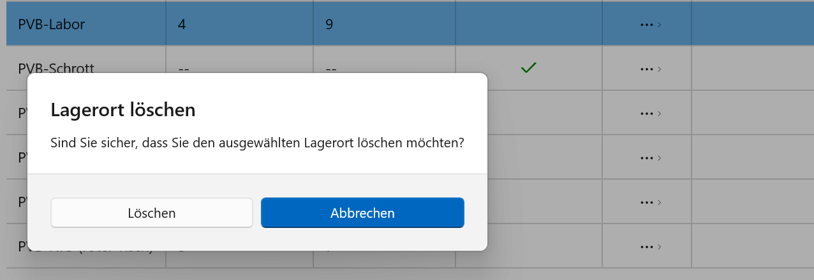

#### Sachnummer
Auf der Übersichtseite der aktuellen Sachnummern findet sich rechts oben die Möglichkeite eine neue Sachnummer hinzuzufügen.
Daneben findet sich ein Suchfeld nach Sachnummern.

In der Tabelle findet sich zu den Sachnummern eine Beschreibung und die Anzahl der maximalen Weitergaben.
Im Untermenü Aktion findet man durchs Daraufklicken die Möglichkeit den gewählten Sachnummer Datensatz zu bearbeiten oder zu löschen.

##### Sachnummer Hinzufügen
Über den Hinzufügen Button kommt man von der Übersicht auf die Erstellungsseite für Sachnummern.
Zuerst muss eine 10-stelltige Sachnummer eingegeben werden. Dann eine Bezeichung kann in das Textfeld darunter geschrieben werden.
Unter Maximale Anzahl der Weitergaben notiert man eine ganze positiven Zahl. Über den Speichern Button wird die Sachnummer gespeichert. Mit Abbrechen wird der Vorgang abgebrochen.

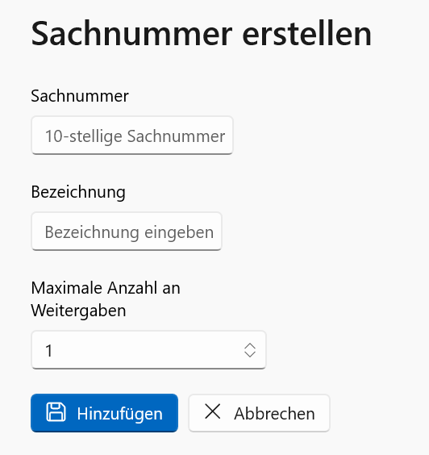

##### Sachnummer Bearbeiten
Das Bearbeitenfenster erhält man über das Akionsmenü rechts an der ausgewählten Sachnummer.
Hier werden die aktuellen Einzelheiten der Sachnummer abgebildet. Bei Bedarf kann die Sachnummer durch einen andere 10 stellige Zahl, die Beizeichnung oder die maximale Anzahl der Weitergaben durch eine ganze positive Zahl ersetzt werden.

##### Sachnummer Löschen
Über das Aktionsmenü rechts an der Sachnumer kann diese gelöscht werden. Dieses Löschen muss bestätigt werden im der sich öffnenden Maske oder kann hier auch nochmal abgebrochen werden.
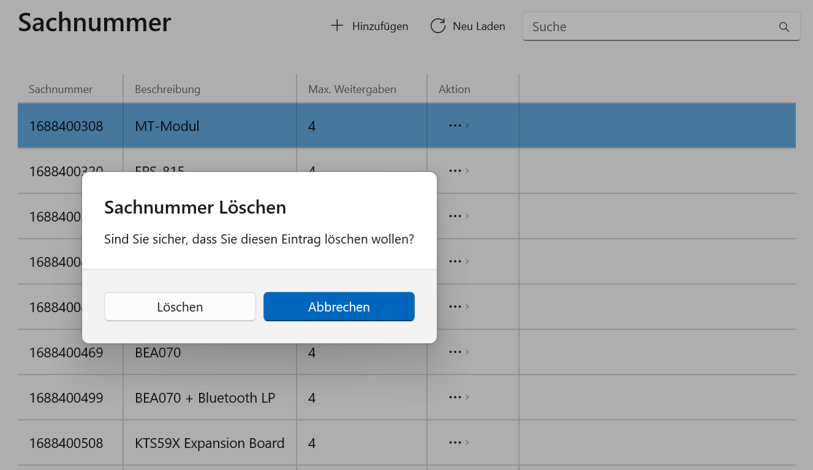

#### Fehlerkategorie
In der Fehlerkatogrie können die aktuellen Kategorien eingesehen werden. Mit der Hinzufügenfunktion oben rechts werden neue Fehlerkategorien erstellt.
Über das Aktionsmenü am rechten Ende eines jeden Fehlerkategorieneintrag kann der jeweilige Eintrag bearbeitet oder gelöscht werden. Oben rechts gibt es zusätzlich eine Suche.

##### Fehlerkategorie Hinzufügen
Hier kann eine neue Fehlerkategorie erstellt werden. Unter Bezeichnung eingeben kann in das Textfeld Bezeichnung ein Name für die neue Fehlerkategorie gewählt werden.

Über Abbrechen kann die Funktion beendet werden und über Hinzufügen wird die neue Fehlerkategorie hinzugefügt.

##### Fehlerkategorie Bearbeiten
Hier wird die aktuelle Fehlerkategorie mit ihrer Eigenschaft angezeigt. Durch Klicken in das jeweilige Textfeld kann die jeweilige Eigenschaft angepasst werden.

Durch das Klicken von "Speichern" wird die Änderung übernommen oder per "Abbrechen" verworfen.

##### Fehlerkategorie Löschen
Über das Aktionsmenü rechts von der Fehlerkategorie kann diese auch gelöscht werden. In einer sich öffnenden Maske muss die Aktion dann nochmal bestätigt werden oder kann abgebrochen werden.

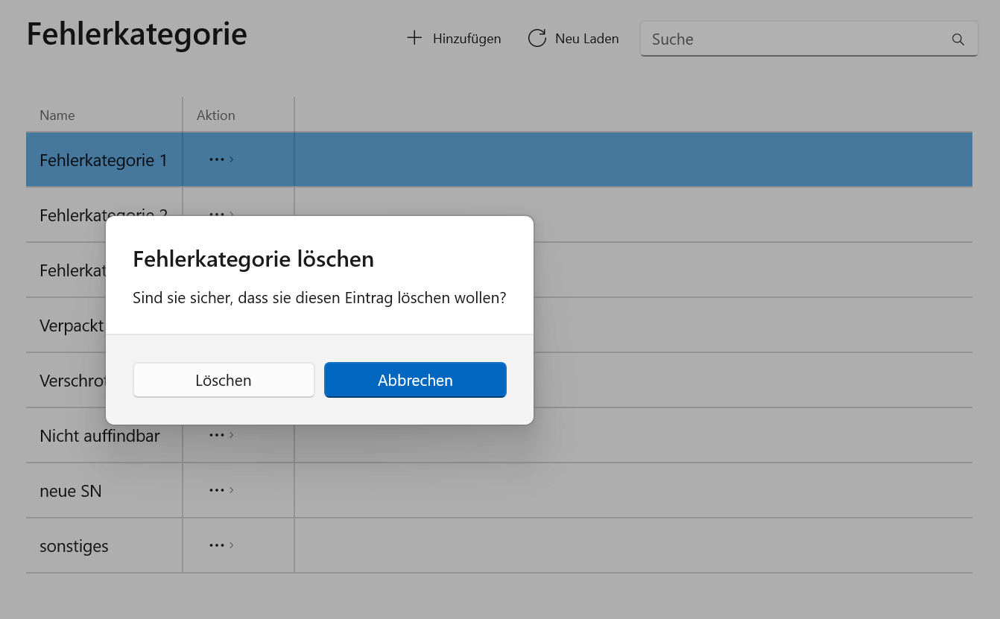

### Einstellungen
Links unten kann man über die Einstellungsfunktion in das Einstellungsfenster wechseln.

Hier kann man zwischen einem dunklen oder hellen Theming für die Anwendung per Klick wechseln.
Zusätzlich gibt es die Möglichkeit eine Standardform (default) auszuwählen.

Auch auf der Seite finden sich einige Informationen zur Anwendung und Datenschutzerklärung.

